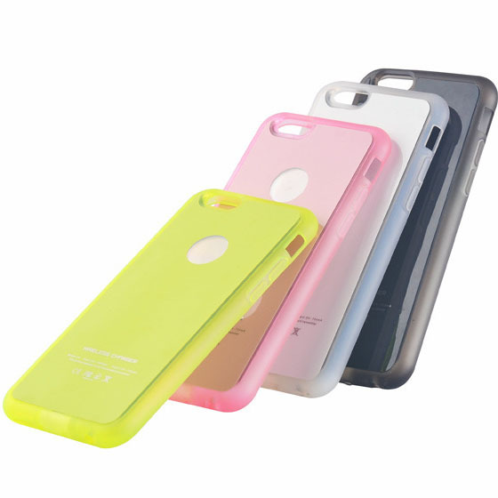
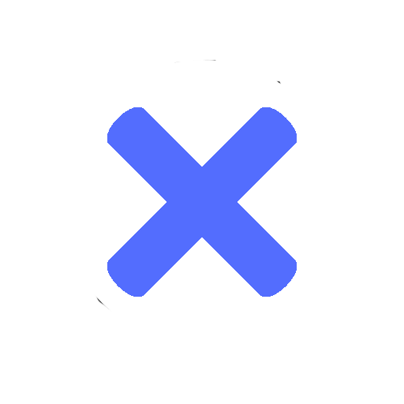

<html>
<head>
	
	<title></title>
  <meta charset="utf-8">
	<link rel="stylesheet" type="text/css" href="style2.css">
	<meta name="forma-detection" content="telephone=no"/>
<meta name="author" content="S Albert"/>
<meta name="vieport" content="width=device-width,
                              height=device-height"/>
<meta name="them-color" content="#fffccc"/>
<meta name="keywords" content="Купить компьютер,Девайсы,BuyDevice"/>
<meta name="description" content=""/>
<meta name="og:title" content="" />
<link rel="stylesheet" type="text/css" href="style1.css">
</head>
<body style="font-family: cooper black">

        <h2 flex md-truncate style="color:#fff;
         position:absolute; 
            left:1vw;
            top: 0.1vh;"
         ><big><strong> <em>BuyDevice</em></strong></big></h2>
        <a href="#" style="color:#fff;
       position: absolute;
        top: 1.7vw;
        left:78vw;
	font-size:1.5vw;
         ">Корзина</a>
         
Наши контакты 7(xxx)xxx-xx-xx

   

   <input type="e-mail" placeholder="Поиск..." name="Поиск" style="
position: absolute;
top: 2vh;
left: 23vw;
width: 43vw;
height: 6vh;
">

  

<ul class="menu-3"  
style="
     margin: 0;
     padding: 0;
     height: auto;
     list-style-type: none;
    background-color:#37474f;

" 
 >
 <li><a href="#" onclick="document.getElementById('lol').style.display='block';
document.getElementById('kek').style.display='none'
document.getElementById('d').style.display='none'
document.getElementById('z1').style.display='none'
document.getElementById('z2').style.display='none'
   ">
Компьютеры
</a></li>
   <li><a href="#" onclick="document.getElementById('kek').style.display='block';
document.getElementById('lol').style.display='none'
document.getElementById('z1').style.display='none'
document.getElementById('d').style.display='none'
document.getElementById('z2').style.display='none'
   ">
Телефоны
</a></li>
   <li><a href="#" onclick="document.getElementById('z1').style.display='block';
document.getElementById('lol').style.display='none'
document.getElementById('d').style.display='none'
document.getElementById('kek').style.display='none'
document.getElementById('z2').style.display='none'
   ">
Аксессуары
</a></li>
</ul>

<h2 style="
position: absolute;
top:9vh;
left:55vw; 
"> Компьютеры</h2>

	
Компьютер Game PC 750SE

		
Цена:91 100р

	<a href="#"
style="
position: absolute;
top: 50vh;
left: 0.5vw;
width: 9vw;
height: 8vh;
background-color:#536dfe;
text-decoration: none;
color: #fff;
border-radius: 10%
" onclick="document.getElementById('d').style.display='block';"
	>
Доставить
</a>
		<a href="#"
style="
position: absolute;
top: 50vh;
left: 10vw;
width: 9vw;
height: 8vh;
background-color:#536dfe;
text-decoration: none;
color: #fff;
border-radius: 10%
" 
	>
Изучить
</a>

		
Системный блок Lenovo IdeaCentre

		
Цена:39990р

	<a href="#"
style="
position: absolute;
top: 50vh;
left: 0.5vw;
width: 9vw;
height: 8vh;
background-color:#536dfe;
text-decoration: none;
color: #fff;
border-radius: 10%
" onclick="document.getElementById('d').style.display='block';"
	>
Доставить
</a>
		<a href="#"
style="
position: absolute;
top: 50vh;
left: 10vw;
width: 9vw;
height: 8vh;
background-color:#536dfe;
text-decoration: none;
color: #fff;
border-radius: 10%
" 
	>
Изучить
</a>

		
Ноутбук HP Pavilion 15

		
Цена:49 990¤

	<a href="#"
style="
position: absolute;
top: 50vh;
left: 0.5vw;
width: 9vw;
height: 8vh;
background-color:#536dfe;
text-decoration: none;
color: #fff;
border-radius: 10%
" onclick="document.getElementById('d').style.display='block';"
	>
Доставить
</a>
		<a href=""
style="
position: absolute;
top: 50vh;
left: 10vw;
width: 9vw;
height: 8vh;
background-color:#536dfe;
text-decoration: none;
color: #fff;
border-radius: 10%
" 
	>
Изучить
</a>

<h2 style="
position: absolute;
top:9vh;
left:55vw; ">Телефоны</h2>

	
Xiaomi Redmi 5 Plus 3/32GB

		
Цена:10 890р

	<a href="#"
style="
position: absolute;
top: 50vh;
left: 0.5vw;
width: 9vw;
height: 8vh;
background-color:#536dfe;
text-decoration: none;
color: #fff;
border-radius: 10%
" onclick="document.getElementById('d').style.display='block';"
	>
Доставить
</a>
		<a href="#"
style="
position: absolute;
top: 50vh;
left: 10vw;
width: 9vw;
height: 8vh;
background-color:#536dfe;
text-decoration: none;
color: #fff;
border-radius: 10%
" 
	>
Изучить
</a>

		
Sony Xperia XZ2

		
Цена:59 990р

	<a href="#"
style="
position: absolute;
top: 50vh;
left: 0.5vw;
width: 9vw;
height: 8vh;
background-color:#536dfe;
text-decoration: none;
color: #fff;
border-radius: 10%
" onclick="document.getElementById('d').style.display='block';"
	>
Доставить
</a>
		<a href="#"
style="
position: absolute;
top: 50vh;
left: 10vw;
width: 9vw;
height: 8vh;
background-color:#536dfe;
text-decoration: none;
color: #fff;
border-radius: 10%
" 
	>
Изучить
</a>

		
Samsung Galaxy J7

		
Цена:16 390p

	<a href="#"
style="
position: absolute;
top: 50vh;
left: 0.5vw;
width: 9vw;
height: 8vh;
background-color:#536dfe;
text-decoration: none;
color: #fff;
border-radius: 10%
" onclick="document.getElementById('d').style.display='block';"
	>
Доставить
</a>
		<a href=""
style="
position: absolute;
top: 50vh;
left: 10vw;
width: 9vw;
height: 8vh;
background-color:#536dfe;
text-decoration: none;
color: #fff;
border-radius: 10%
" 
	>
Изучить
</a>

<h2 style="
position: absolute;
top:9vh;
left:55vw; 
">Аксессуары</h2>

	
Чехлы для телефона

		
Цена:от 100р

	<a href="#"
style="
position: absolute;
top: 50vh;
left: 0.5vw;
width: 9vw;
height: 8vh;
background-color:#536dfe;
text-decoration: none;
color: #fff;
border-radius: 10%
" onclick="document.getElementById('d').style.display='block';"
	>
Доставить
</a>
		<a href="#"
style="
position: absolute;
top: 50vh;
left: 10vw;
width: 9vw;
height: 8vh;
background-color:#536dfe;
text-decoration: none;
color: #fff;
border-radius: 10%
" 
	>
Изучить
</a>

		
Зарядное устройство для телефона

		
Цена:500р-1000р

	<a href="#"
style="
position: absolute;
top: 50vh;
left: 0.5vw;
width: 9vw;
height: 8vh;
background-color:#536dfe;
text-decoration: none;
color: #fff;
border-radius: 10%
" onclick="document.getElementById('d').style.display='block';"
	>
Доставить
</a>
		<a href="#"
style="
position: absolute;
top: 50vh;
left: 10vw;
width: 9vw;
height: 8vh;
background-color:#536dfe;
text-decoration: none;
color: #fff;
border-radius: 10%
" 
	>
Изучить
</a>

		
Наушники

		
Цена:550р

	<a href="#"
style="
position: absolute;
top: 50vh;
left: 0.5vw;
width: 9vw;
height: 8vh;
background-color:#536dfe;
text-decoration: none;
color: #fff;
border-radius: 10%
" onclick="document.getElementById('d').style.display='block';"
	>
Доставить
</a>
		<a href=""
style="
position: absolute;
top: 50vh;
left: 10vw;
width: 9vw;
height: 8vh;
background-color:#536dfe;
text-decoration: none;
color: #fff;
border-radius: 10%
" 
	>
Изучить
</a>

Вы выбрали Доставку

Город:

<select style="
position: absolute;
top:7vh;
left:6vw;
">
<option>Казань</option>
<option>Москва</option>	
<option>Воронеж</option>
</select>

Укажите улицу
<input type="text" name="Улица"
style="
position: absolute;
top:12.2vh; 
left:12vw;
width: 11vw;
height:3vh;
" 
>

Номер карты:
<input type="text" name="Номер" style="
position: absolute;
top:12vh ;
left:25vw ;
width: 8vw;
height: 3vh;
">

Срок действия:

<select style="
position: absolute;
top:21vh ;
left:2vw ;
">
	<option>1</option>
		<option>2</option>
		<option>3</option>
		<option>4</option>
		<option>5</option>
		<option>6</option>
		<option>7</option>
		<option>8</option>
		<option>9</option>
		<option>10</option>
		<option>11</option>
		<option>12</option>

</select>
<select style="
position: absolute;
top:21vh ;
left:6vw ;
">
		<option>2018</option>
		<option>2017</option>
		<option>2016</option>
		<option>2015</option>
		<option>2014</option>
</select>

Имя владельца:

<input type="text" name="like" style="
position: absolute;
top:21vh ;
left:15vw ;
width: 10vw;
height:3vh ;
">

CVV2:

<input type="text" name="CVV2" style="
position: absolute;
top: 26.3vh;
left: 5vw;
width:5vw ;
height:3vh ;
">
<a href="" onclick="document.getElementById('d').style.display='none'"
style="
position: absolute;
top:29vh ;
left:14vw ;
width:8vw ;
height:8vh ;
color: #000;
border-style: solid;
border-radius: 5%;
border-color: #c5ced8; 

" 
>
 Оплатить
</a>

</body>
</html>

